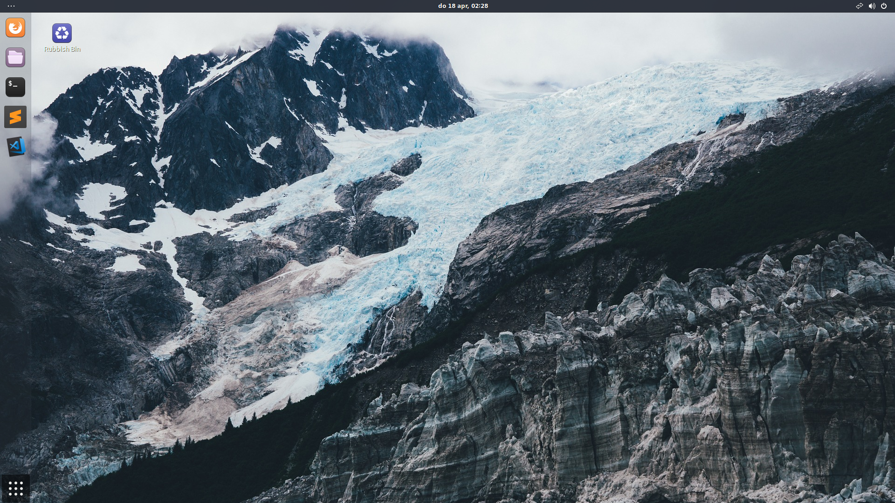

# ubuntu-theme-arc-setup
Follow these steps to style your Ubuntu distro using the Arc theme like the picture below.


## Update package cache
```Bash
sudo apt update
```

## Desktop background
```Bash
curl https://pixabay.com/get/e133b80a21f71c22d9584518a33219c8b66ae3d01cb4144597f3c67e/glacier-869593_1920.jpg > ~/Pictures/background.jpg
```
If that doesn't work, open a browser and go to the following URL to download the image: https://pixabay.com/photos/glacier-mountain-snow-hillside-869593/. Put the image in the `Pictures` folder of your home directory and rename it to `background.jpg`.

## Profile picture
```Bash
curl -L https://www.dropbox.com/s/xnijntyzt74c3rv/slash_hat_and_guitar.jpg?dl=1 > ~/Pictures/profile.jpg
```

## Arc theme
```Bash
sudo apt install arc-theme
```

## Pocillo icons
```Bash
sudo apt install pocillo-icon-theme
```

## GNOME Tweaks
```Bash
sudo apt install gnome-tweak-tool
```
To disable mouse acceleration, launch Gnome Tweaks, go to the `Keyboard & Mouse` tab and set `Acceleration Profile` to `Flat`.

## GNOME Shell Extensions
```Bash
sudo apt install gnome-shell-extensions
```
Log out and log back in to reload the GNOME shell. Launch GNOME Tweaks, go to the `Extensions` tab, enable `User Themes`, relaunch GNOME Tweaks, go to the `Appearance` tab and select the `Arc-Dark` shell theme. Set the `Applications` theme to `Arc-Dark` and the `Icons` theme to `Pocillo`. Select the `background.jpg` image in the `Pictures` folder of your home directory for both the `Background Image` and the `Lock Screen Image`. Go to the `Top Bar` tab and enable `Clock Date`. Launch the computer settings, go to the `Users` tab and select the `profile.jpg` image in the `Pictures` folder of your home directory.

## Screenfetch
```Bash
sudo apt install screenfetch
```
The `screenfetch` command should display `WM Theme: Arc-Dark`, `GTK Theme: Arc-Dark [GTK2/3]` and `Icon Theme: Pocillo`.

## Ubuntu login background
Open `/usr/share/gnome-shell/theme/gdm3.css` and edit `#lockDialogGroup` by commenting out the existing `background` style and adding `background-color: #383c46;`. A reboot might be required for these changes to take effect.
